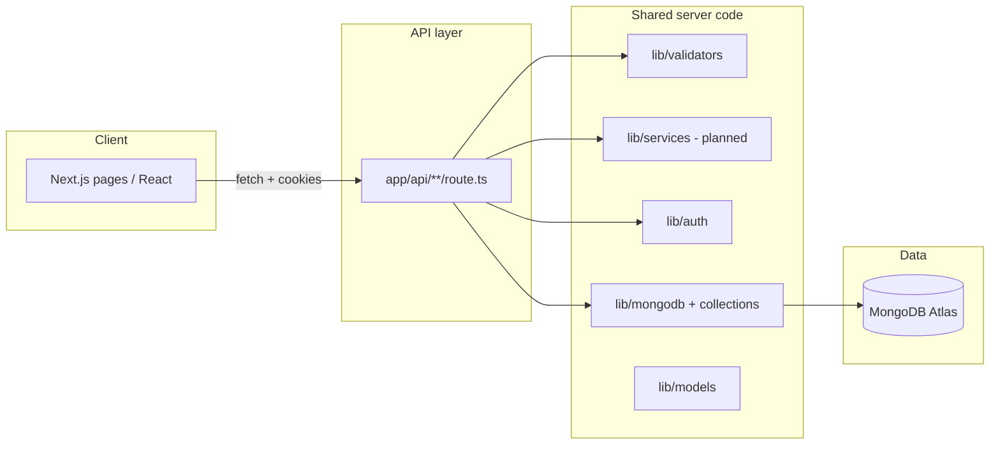

# PlantMart — Backend structure (handoff)

**Branch:** `dev-ashik`  
**Stack:** Next.js 15 App Router (Route Handlers) + MongoDB Atlas + JWT session cookies  
**Database:** `plantmart` (default; override with `MONGODB_DB`)  
**Last updated:** May 2026

This document describes how the backend is organized today, how auth and roles work, and where new API modules should live.

---

## 1. Architecture overview



**Conventions**

- HTTP APIs live under `app/api/<resource>/route.ts` (one folder per resource or action group).
- Route handlers stay thin: parse input, authorize, call `lib/`, return JSON.
- MongoDB access goes through `lib/mongodb.ts` and collection helpers (not ad-hoc clients in routes).
- Request bodies are validated with **Zod** in `lib/validators/`.
- Passwords are hashed with **bcryptjs**; sessions are **JWT** in an **httpOnly** cookie (`plantmart_session`), signed with **jose** and `AUTH_SECRET`.

---

## 2. Repository layout

### 2.1 Implemented (Phase 1 — identity)

```text
plantmart/
├── app/api/
│   ├── auth/
│   │   ├── bootstrap-admin/route.ts   # One-time first admin (env secret)
│   │   ├── login/route.ts
│   │   ├── logout/route.ts
│   │   ├── me/route.ts
│   │   └── register/route.ts
│   └── users/route.ts                 # Admin: list users (optional ?role=)
├── lib/
│   ├── mongodb.ts                     # Singleton MongoClient (dev HMR-safe)
│   ├── auth/
│   │   ├── cookie.ts                  # Cookie name constant
│   │   ├── get-session.ts             # Read session from request cookies
│   │   └── session.ts                 # Sign / verify JWT, cookie options
│   ├── models/
│   │   └── user.ts                    # UserDocument, roles, toPublicUser()
│   ├── users/
│   │   └── collection.ts              # users collection + indexes
│   └── validators/
│       └── auth.ts                    # Zod schemas for auth bodies
├── context/
│   └── AuthContext.tsx                # Client: /api/auth/me, login, logout
├── .env.example
└── docs/
    └── BACKEND_STRUCTURE.md           # This file
```

### 2.2 Recommended (Phase 2+ — marketplace)

Add modules in the same pattern; do not put business logic in page components.

```text
app/api/
├── products/
│   ├── route.ts                       # GET list, POST create (seller)
│   └── [id]/route.ts                  # GET one, PATCH, DELETE
├── orders/
│   ├── route.ts                       # GET (role-scoped), POST checkout
│   └── [id]/route.ts                  # GET one, PATCH status
├── sellers/
│   └── [id]/route.ts                  # Public seller profile + catalog
├── addresses/
│   └── route.ts                       # Buyer delivery addresses
└── admin/
    ├── orders/route.ts                # Admin order oversight
    ├── products/route.ts              # Moderation / catalog admin
    └── settings/route.ts              # Platform settings document

lib/
├── models/
│   ├── product.ts
│   ├── order.ts
│   └── address.ts
├── validators/
│   ├── product.ts
│   └── order.ts
├── services/                          # Optional: reusable domain logic
│   ├── products.ts
│   └── orders.ts
├── middleware/
│   └── require-role.ts                # requireSession(), requireRole('admin')
└── errors/
    └── api-error.ts                   # Consistent { error, details } + status codes
```

**Frontend still on mock data (not wired to API yet):** catalog (`app/plants`), admin products/orders, seller products/orders, cart checkout persistence.

---

## 3. Roles and access

| Role    | Created via                         | Typical API access                          |
|---------|-------------------------------------|---------------------------------------------|
| `buyer` | `POST /api/auth/register`           | Own profile, cart/checkout, orders (future) |
| `seller`| `POST /api/auth/register` + `shopName` | Own products, seller orders (future)     |
| `admin` | `POST /api/auth/bootstrap-admin` once | `GET /api/users`, admin modules (future) |

**Session:** After login or register, the server sets cookie `plantmart_session`. `GET /api/auth/me` returns the current user or `{ user: null }`. Logout clears the cookie.

**Authorization today:** Each route checks the session inline (e.g. `session.role === 'admin'` on `GET /api/users`). Phase 2 should centralize checks in `lib/middleware/require-role.ts`.

---

## 4. MongoDB

### 4.1 Connection

- **Env:** `MONGODB_URI` (required), `MONGODB_DB` (optional, default `plantmart`).
- **Client:** `lib/mongodb.ts` — single reused client; small pool (`maxPoolSize: 5`) suited to Next.js serverless/route handlers.
- **Never commit** real credentials; use `.env.local` (gitignored). See `.env.example`.

### 4.2 Collection: `users` (live)

| Field           | Type     | Notes                                      |
|-----------------|----------|--------------------------------------------|
| `_id`           | ObjectId | Primary key                                |
| `email`         | string   | Unique index, stored lowercase             |
| `passwordHash`  | string   | bcrypt, cost 12                            |
| `name`          | string   | Display name                               |
| `role`          | string   | `admin` \| `seller` \| `buyer`             |
| `shopName`      | string?  | Required for sellers at registration       |
| `phone`         | string?  | Reserved                                   |
| `createdAt`     | Date     |                                            |
| `updatedAt`     | Date     |                                            |

**Indexes (created on first use):** unique `email`, index `role`.

**API shape (public user):** `id`, `email`, `name`, `role`, `phone?`, `shopName?`, `createdAt` (ISO string). Password hash is never returned.

### 4.3 Planned collections (not implemented)

| Collection   | Owner / key relationships        | Purpose                          |
|--------------|----------------------------------|----------------------------------|
| `products`   | `sellerId` → `users._id`         | Seller catalog                   |
| `orders`     | `buyerId`, line items, `status`  | Checkout and fulfillment         |
| `addresses`  | `userId`                         | Buyer shipping addresses         |
| `settings`   | Single doc or keyed docs         | Admin platform config            |

---

## 5. API reference (implemented)

Base URL: same origin as the app (e.g. `http://localhost:3000`). Send `Content-Type: application/json` on POST bodies. Use `credentials: 'include'` from the browser so cookies are sent.

### Auth

| Method | Path                         | Auth   | Description |
|--------|------------------------------|--------|-------------|
| POST   | `/api/auth/register`         | None   | Register buyer or seller. Body: `name`, `email`, `password` (min 8), `role` (`buyer` \| `seller`), `shopName` required if seller. Sets session cookie. |
| POST   | `/api/auth/login`            | None   | Body: `email`, `password`. Sets session cookie. |
| POST   | `/api/auth/logout`           | Cookie | Clears session. |
| GET    | `/api/auth/me`               | Cookie | `{ user: PublicUser \| null }`. |
| POST   | `/api/auth/bootstrap-admin`  | None   | First admin only. Body: `secret` (must match `BOOTSTRAP_ADMIN_SECRET`), `name`, `email`, `password`. Returns 503 if bootstrap env not set. |

**Example register (buyer):**

```json
POST /api/auth/register
{
  "name": "Jane Doe",
  "email": "jane@example.com",
  "password": "securepass123",
  "role": "buyer"
}
```

**Example register (seller):**

```json
POST /api/auth/register
{
  "name": "Nursery Owner",
  "email": "seller@example.com",
  "password": "securepass123",
  "role": "seller",
  "shopName": "Green Garden Nursery"
}
```

### Users (admin)

| Method | Path              | Auth   | Description |
|--------|-------------------|--------|-------------|
| GET    | `/api/users`      | Admin  | List users, newest first (max 200). |
| GET    | `/api/users?role=seller` | Admin | Filter by `admin`, `seller`, or `buyer`. |

**Success:** `{ "users": [ ...PublicUser ] }`  
**Errors:** `403 Forbidden`, `500` with `{ "error": "..." }`.

### Common error pattern

- `400` — validation failed (`details` from Zod field errors when applicable).
- `401` — invalid login credentials.
- `403` — missing or insufficient role.
- `409` — duplicate email.
- `500` — unexpected server/database error.

---

## 6. Environment variables

| Variable                 | Required | Purpose |
|--------------------------|----------|---------|
| `MONGODB_URI`            | Yes      | Atlas connection string (include DB name in path when possible). |
| `MONGODB_DB`             | No       | Database name if not in URI (default `plantmart`). |
| `AUTH_SECRET`            | Yes      | JWT signing secret, minimum 32 characters. |
| `BOOTSTRAP_ADMIN_SECRET` | No*      | *Required only to create the first admin; unset after use. |
| `NEXT_PUBLIC_APP_URL`    | No       | Public site URL for absolute links. |

Generate secrets locally:

```bash
node -e "console.log(require('crypto').randomBytes(32).toString('hex'))"
```

**Atlas:** allow application IPs under Network Access; rotate credentials if exposed.

---

## 7. Local setup (for reviewers)

```bash
git checkout dev-ashik
npm install
cp .env.example .env.local
# Edit .env.local with MONGODB_URI and AUTH_SECRET
npm run dev
```

Create the first admin (once, with dev server running):

```bash
curl -X POST http://localhost:3000/api/auth/bootstrap-admin \
  -H "Content-Type: application/json" \
  -d '{"secret":"<BOOTSTRAP_ADMIN_SECRET>","name":"Admin","email":"admin@example.com","password":"AtLeast8Chars"}'
```

Production check: `npm run build` then `npm start`.

---

## 8. UI integration status

| Area              | Backend status |
|-------------------|----------------|
| Login / register  | Wired to `/api/auth/*` |
| Session / navbar  | `AuthContext` → `/api/auth/me` |
| Admin → sellers   | `GET /api/users?role=seller` |
| Admin → orders    | Mock data only |
| Admin → products  | Mock data only |
| Catalog / PDP     | Mock data only |
| Cart / checkout   | Client state only |

---

## 9. Suggested work breakdown (for team lead)

1. **Auth hardening** — `requireRole` helper, rate limiting on login/register, optional email verification.
2. **Products API** — CRUD scoped to `sellerId`; public list/detail with filters (category, seller, price).
3. **Orders API** — create from cart, status workflow (`pending` → `processing` → `shipped` → `delivered`), buyer vs seller vs admin views.
4. **Addresses API** — CRUD for buyers; link to checkout.
5. **Admin settings** — persist `admin/settings` UI to MongoDB.
6. **Replace mocks** — point `app/plants`, seller dashboards, and admin orders/products to new endpoints.
7. **Tests** — route handler tests or integration tests against a test database.

---

## 10. Dependencies (backend-related)

| Package    | Use |
|------------|-----|
| `mongodb`  | Database driver |
| `bcryptjs` | Password hashing |
| `jose`     | JWT sign/verify |
| `zod`      | Request validation |

---

## 11. Security notes for production

- Keep secrets in environment variables only; never in git or client bundles.
- Use `secure` cookies when served over HTTPS (`NODE_ENV=production`).
- Rotate Atlas user password if the connection string was shared in chat or tickets.
- Restrict `bootstrap-admin` to initial provisioning; remove or disable `BOOTSTRAP_ADMIN_SECRET` after the first admin exists.
- Add input limits, indexing, and pagination on list endpoints before high traffic.

---

**Contact / ownership:** Backend work on branch `dev-ashik`. Questions on extending this layout should follow the folder and naming rules in sections 2 and 9.
